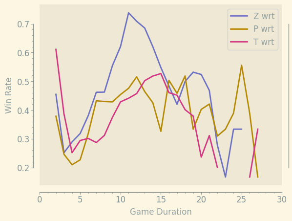

    

        <h2>UpATree Ladder Stats</h2>
        <table ">
  <thead>
    <tr style="text-align: right;">
      <th></th>
      <th>Stats</th>
    </tr>
  </thead>
  <tbody>
    <tr>
      <th>Matches Played</th>
      <td>973.0</td>
    </tr>
    <tr>
      <th>MMR Gained</th>
      <td>9337.0</td>
    </tr>
    <tr>
      <th>MMR lost</th>
      <td>9614.0</td>
    </tr>
    <tr>
      <th>Max MMR</th>
      <td>4846.0</td>
    </tr>
    <tr>
      <th>Min MMR</th>
      <td>4458.0</td>
    </tr>
    <tr>
      <th>Longest Win Streak</th>
      <td>9.0</td>
    </tr>
    <tr>
      <th>Longest Loss Streak</th>
      <td>8.0</td>
    </tr>
    <tr>
      <th>Highest MMR Beaten</th>
      <td>6219.0</td>
    </tr>
    <tr>
      <th>Lowest MMR Thrown to</th>
      <td>2956.0</td>
    </tr>
  </tbody>
</table>
    

    

        <h2>Nemeses</h2>
        <table ">
  <thead>
    <tr style="text-align: right;">
      <th></th>
      <th>ΔMMR</th>
    </tr>
    <tr>
      <th>Opponent</th>
      <th></th>
    </tr>
  </thead>
  <tbody>
    <tr>
      <th>Kallari</th>
      <td>270.0</td>
    </tr>
    <tr>
      <th>gaschem</th>
      <td>255.0</td>
    </tr>
    <tr>
      <th>Hirisch</th>
      <td>249.0</td>
    </tr>
    <tr>
      <th>OriOn</th>
      <td>157.0</td>
    </tr>
    <tr>
      <th>theglml</th>
      <td>153.0</td>
    </tr>
    <tr>
      <th>Archaleon</th>
      <td>149.0</td>
    </tr>
    <tr>
      <th>GhostDragon</th>
      <td>122.0</td>
    </tr>
    <tr>
      <th>Kyoshi</th>
      <td>101.0</td>
    </tr>
    <tr>
      <th>BaumesBaum</th>
      <td>99.0</td>
    </tr>
    <tr>
      <th>igor</th>
      <td>99.0</td>
    </tr>
  </tbody>
</table>
    

## Games by Race

| Race    |   Wins |   Losses |   Total |   Win Rate (%) |   MMR Gained |   MMR Lost |
|:--------|-------:|---------:|--------:|---------------:|-------------:|-----------:|
| Protoss |    172 |      217 |     389 |        44.2159 |         3225 |       3497 |
| Terran  |     95 |      131 |     226 |        42.0354 |         2335 |       1804 |
| Zerg    |    206 |      151 |     357 |        57.7031 |         3240 |       3250 |

